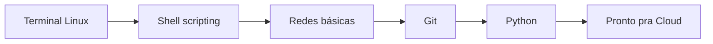

# 01 · Fundamentos

**Tempo que gastei aqui:** ~40h (levei mais que isso, se for sincero, porque fiquei preso um bom tempo tentando entender rebase) · **Pré-requisito:** nenhum · **Próxima:** [02 · Cloud computing →](./02-cloud-computing.md)

## Por que comecei por aqui

Eu tentei pular direto pra Kubernetes duas vezes antes de escrever isso. Nas duas eu travei porque não sabia ler uma mensagem de erro de permissão, não entendia por que um `curl` funcionava do meu notebook mas não de dentro de um container, e não tinha a menor ideia do que era `rebase` além de "aquele comando que o Git sugere quando dá conflito". Comecei do zero de novo, dessa vez pela base, e valeu muito mais a pena. Se você está pensando em pular esta etapa porque "já sabe o básico de Linux", pelo menos garante que consegue explicar a diferença entre `chmod 755` e `chmod 750` sem procurar — se não conseguir, fica.



## Linha de comando Linux

A parte de permissões parece decoreba no começo, mas depois de um tempo vira intuição. O sistema divide em três grupos — dono, grupo, outros  e três tipos de acesso  ler, escrever, executar. Quando eu rodo `ls -l` e vejo `-rwxr-xr--`, hoje eu já leio isso automaticamente: dono pode tudo, grupo pode ler e executar, o resto só lê.

```bash
chmod 750 deploy.sh        # dono: rwx, grupo: r-x, outros: nada
chown ana:devops deploy.sh # dono vira "ana", grupo vira "devops"
```

O que ninguém me falou de cara, e que eu descobri sofrendo, é que quase todo "Permission denied" chato em produção volta pra essa tabela de três colunas. Vale a pena entender de verdade, não só decorar os números.

Sobre systemd: no começo eu achava que era só "o comando pra ligar e desligar coisa". É mais que isso — ele gerencia serviços como unidades, com dependências entre elas, reinicia automaticamente se cair, mantém log. Os três comandos que eu uso o tempo todo:

```bash
systemctl status nginx     # tá rodando?
systemctl restart nginx    # reinicia
journalctl -u nginx -f     # acompanha o log em tempo real — esse aqui salvou minha vida um monte de vez
```

## Shell scripting em bash

Meu primeiro script de verdade não tinha `set -euo pipefail` no topo, e um comando no meio falhou silenciosamente sem eu perceber  o script continuou rodando como se nada tivesse acontecido e eu só fui notar o estrago no dia seguinte. Desde então essa linha vai em todo script que escrevo:

```bash
#!/usr/bin/env bash
set -euo pipefail  # para tudo na primeira falha — não é opcional, é hábito

THRESHOLD=80
USO_DISCO=$(df / | awk 'NR==2 {print $5}' | tr -d '%')

if [ "$USO_DISCO" -ge "$THRESHOLD" ]; then
  echo "Alerta: disco em ${USO_DISCO}%"
  exit 1
fi

echo "Disco OK: ${USO_DISCO}%"
```

`-e` para no primeiro erro, `-u` reclama se você usar uma variável que nunca foi definida (isso pegou muito bug bobo meu de digitação), `-o pipefail` garante que uma falha no meio de um pipe não passe despercebida.

## Redes: TCP/IP, DNS e HTTP/HTTPS

Confesso que essa parte eu só entendi de verdade quando tentei debugar um "site fora do ar" que na real era um problema de DNS propagando devagar  passei umas duas horas achando que era o servidor até perceber que era isso. Então: o TCP garante que os pacotes cheguem completos e na ordem certa (aquele handshake SYN, SYN-ACK, ACK que todo curso mostra), o IP é quem entrega o pacote de um endereço a outro.

DNS traduz nome em número. `exemplo.com` vira um IP através de uma cadeia de consultas (raiz → domínio de topo → autoritativo). O motivo de eu insistir tanto nisso é simples: uma fatia gigante dos "está fora do ar" que você vai encontrar na vida real não é a aplicação quebrada, é DNS mal configurado ou ainda propagando.

HTTP é pergunta e resposta: o cliente manda um método (`GET`, `POST`, `PUT`, `DELETE`) pra um caminho, o servidor devolve um código (`200` deu certo, `404` não achei, `500` quebrei aqui do meu lado). HTTPS é o mesmo protocolo dentro de uma camada de criptografia (TLS)  antes de qualquer dado da aplicação trafegar, rola uma negociação de certificados e chaves.

## Proxies reversos (nginx e HAProxy)

A explicação que fez clique pra mim: um proxy reverso é o "recepcionista" da sua aplicação. Ele fica na frente, recebe todo mundo, decide pra onde manda cada requisição, e sua aplicação nunca fica exposta direto pra internet.

```nginx
server {
    listen 443 ssl;
    server_name exemplo.com;

    location / {
        proxy_pass http://127.0.0.1:3000;
        proxy_set_header Host $host;
        proxy_set_header X-Real-IP $remote_addr;
    }
}
```

Isso resolve três coisas de uma vez: o TLS termina num lugar só, dá pra balancear carga entre várias instâncias da aplicação, e ninguém de fora fala diretamente com o seu processo Node/Python/o-que-for.

## Git: branches, merge e rebase

Essa foi a parte que mais me confundiu no começo, então vou tentar explicar do jeito que eu queria ter lido. Uma branch é só um ponteiro que se move  nada mais místico que isso. `merge` junta duas branches criando um commit novo que representa essa junção, preservando os dois caminhos de histórico. `rebase` pega seus commits e finge que eles foram feitos em cima do estado mais recente da outra branch reescreve o histórico, gera hashes novos.

```bash
git checkout feature/login
git rebase main             # reaplica os commits de feature/login em cima de main
git checkout main
git merge feature/login      # fast-forward, sem commit de merge
```

A regra que eu sigo hoje, depois de estragar o histórico de um repositório compartilhado uma vez: rebase só em branch que é só sua, que mais ninguém puxou ainda. Se outra pessoa já baixou aquela branch, use merge  reescrever histórico que já foi compartilhado é dor de cabeça garantida pra todo mundo.

## Pull requests

Um PR é o pedido pra juntar suas mudanças numa branch (normalmente `main`). O valor real dele não é burocracia é ter outra pessoa lendo seu código antes dele ir pra produção, pegando coisa que você não vê mais depois de olhar pro mesmo código por três horas seguidas. E é também onde o pipeline de CI roda (ver a [etapa 04](./04-ci-cd.md)) — os testes acontecem ali, antes do merge, não depois.

## Python pra automação e scripts

Python virou minha escolha padrão pra qualquer script que precise falar com uma API ou mexer em arquivo  a sintaxe não atrapalha e tem biblioteca pronta pra praticamente tudo.

```python
import requests

def verificar_servico(url: str) -> bool:
    try:
        resposta = requests.get(url, timeout=5)
        return resposta.status_code == 200
    except requests.RequestException:
        return False

if not verificar_servico("https://exemplo.com/health"):
    print("Serviço fora do ar!")
```

## Erros que eu cometi (e você provavelmente vai cometer também)

- Rodei script como root por preguiça de configurar permissão direito  isso escondeu um bug de permissão que só apareceu (bem pior) semanas depois, já em produção.
- Escrevi script sem `set -e` e não percebi um comando falhando no meio, silenciosamente.
- Fiz rebase numa branch que um colega já tinha puxado. Ele teve que resolver conflito estranho porque os hashes dos commits mudaram embaixo dele. Peço desculpas até hoje.
- Deixei arquivo de log e `__pycache__` versionados no Git por não ter um `.gitignore` decente desde o commit inicial.

## Exercício que eu faria de novo se estivesse começando

1. Escreva um script `monitor.sh` que checa disco e memória, saindo com código `1` se algum passar de 80%.
2. Bota `set -euo pipefail` no topo.
3. Versiona num repositório novo, em pelo menos 3 commits não um commit gigante com tudo junto (essa foi outra coisa que eu fiz errado no começo).
4. Cria uma branch `feature/monitor-memoria`, adiciona a checagem de memória lá, junta de volta em `main` com rebase.
5. **Confere:** roda `git log --oneline --graph`. O histórico deveria estar linear, sem commit de merge no meio.

## Perguntas que eu me faço pra saber se entendi de verdade

<details>
<summary>Qual a diferença prática entre rebase e merge?</summary>

Merge preserva os dois históricos e cria um commit de junção. Rebase reescreve seus commits em cima do estado atual da branch de destino, deixando tudo linear  mas troca os hashes, então nunca faz isso numa branch que outra pessoa já tem localmente.
</details>

<details>
<summary>Por que eu insisto tanto em botar set -euo pipefail em todo script?</summary>

Porque sem isso, um comando pode falhar no meio do script e o resto continua rodando como se nada tivesse acontecido  foi exatamente o que me aconteceu da primeira vez, e só descobri o estrago no dia seguinte.
</details>

<details>
<summary>O que rola de fato quando você abre um site HTTPS pela primeira vez?</summary>

O navegador resolve o domínio via DNS, abre uma conexão TCP com o IP resultante, e faz um handshake TLS  troca de certificado, verificação de confiança, negociação de chave. Só depois disso a requisição HTTP em si trafega, já criptografada.
</details>

## Termos que eu tive que procurar mais de uma vez

| Termo | O que significa |
|---|---|
| PID | Número que identifica um processo rodando |
| systemd unit | Definição de um serviço gerenciado pelo systemd |
| DNS | Traduz nome de domínio pra endereço IP |
| TLS | A criptografia por trás do HTTPS |
| fast-forward | Merge sem commit de junção, quando o histórico já tá linear |

## Onde eu fui aprofundar

- [Linux Journey](https://linuxjourney.com/) — foi por aqui que eu realmente entendi permissões
- [Git — documentação oficial](https://git-scm.com/doc)
- [GitHub Docs — Pull Requests](https://docs.github.com/en/pull-requests)
- [Python — tutorial oficial](https://docs.python.org/3/tutorial/)

---
**Próxima etapa:** [02 · Cloud computing →](./02-cloud-computing.md)
