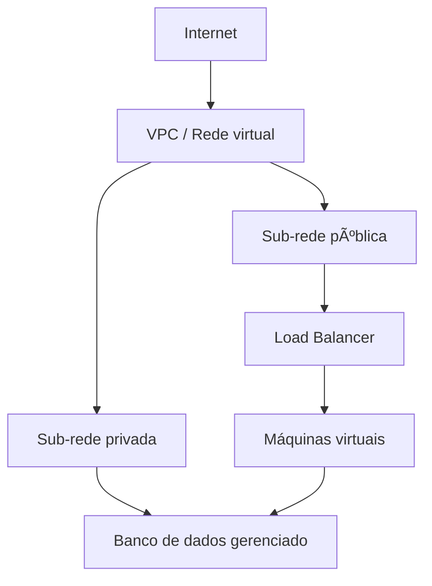

# 02· Cloud computing

**Tempo que gastei aqui:** ~30h · **Pré-requisitos:** [01· Fundamentos](./01-fundamentos.md) · **Próximo:** [03 · Containers ](./03-containers.md)

## Por que essa etapa vem logo depois dos fundamentos

Confesso que fiquei tentado a pular direto pra containers depois da etapa 1, porque "cloud é só clicar em botão", certo? Errado. Eu criei minha primeira VPC inteira numa sub rede pública só, sem separar nada, porque não entendia direito pra que servia isolar rede. Funcionou até eu perceber, olhando a fatura, que tinha deixado um banco de dados acessível da internet inteira sem querer. Nada vazou (sorte), mas foi o susto que me fez voltar e entender isso direito antes de seguir em frente.



## Responsabilidade compartilhada e IAM

A ideia central, resumida do jeito que eu queria ter ouvido antes: o provedor cuida do datacenter, do hardware, da rede física. Você cuida de tudo que roda dentro — configuração, dados, quem tem acesso a quê. Bucket público por engano? Isso é 100% culpa sua, não do provedor.

IAM é o sistema de quem-pode-fazer-o-quê. O princípio que eu tento seguir hoje (e que não segui na primeira vez, veja acima) é privilégio mínimo: dá pra pessoa ou serviço só o que ela precisa, nunca "admin geral porque é mais fácil agora".

```json
{
  "Effect": "Allow",
  "Action": ["s3:GetObject"],
  "Resource": "arn:aws:s3:::meu-bucket/*"
}
```

Essa política aqui só deixa ler um bucket específico. Nada de listar, escrever ou deletar. Parece pouco, mas é exatamente esse tipo de restrição que teria evitado meu susto.

## Redes virtuais e sub-redes (VPC)

Depois do episódio do banco exposto, essa é a parte que eu mais insisto em explicar direito. Uma VPC é uma rede isolada dentro do provedor, onde você desenha suas próprias sub-redes:

- **Sub-rede pública** ” tem rota pra internet. Load balancer e bastion host moram aqui.
- **Sub-rede privada** ” sem rota direta pra internet. Banco de dados e serviço interno moram aqui.

O ponto que eu não tinha entendido antes: isso não é só organização, é uma barreira estrutural. Um recurso numa sub-rede privada simplesmente não tem como ser alcançado de fora  nem que alguém descubra o IP dele. É diferente (e mais forte) do que só confiar numa regra de firewall que alguém pode configurar errado.

## Máquinas virtuais e escalonamento

Uma VM é um servidor que você aluga. A parte legal é o auto scaling: em vez de comprar uma máquina gigante "pra aguentar o pico do fim do mês", você configura um grupo que cresce e encolhe sozinho.

```
Se CPU média > 70% por 5 minutos →’ adiciona 1 instância
Se CPU média < 30% por 10 minutos →’ remove 1 instância
M­ínimo: 2 · Máximo: 10
```

Isso resolveu, pra mim, o dilema de "pago caro o tempo todo" versus "não aguento quando precisa". As duas pontas ficam cobertas.

## Armazenamento de objetos

Diferente de um disco comum, armazenamento de objetos guarda arquivo por chave única, acessado via API não é um sistema de pastas tradicional. É assim que dá pra guardar uma quantidade absurda de dado sem gastar fortuna. E sim, vou repetir: configure como privado por padrão. Bucket público por acidente é, sem exagero, um dos erros mais caros e mais comuns que existem em cloud.

## Bancos de dados gerenciados

Um banco gerenciado tira de você a parte chata: backup, patch de segurança, réplica. Você perde um pouco de controle fino, ganha um tempo enorme de operação. Pra mim, hoje, essa é sempre a primeira opção só considero rodar meu próprio banco numa VM se tiver um motivo bem específico pra isso, e normalmente não tenho.

## Funções serverless

Serverless é você escrever só a função que reage a um evento  uma requisição, um arquivo que chegou, uma mensagem numa fila  e o provedor cuida do resto. Você paga por execução, não por tempo ligado.

```python
def handler(event, context):
    nome_arquivo = event["Records"][0]["s3"]["object"]["key"]
    print(f"Novo arquivo recebido: {nome_arquivo}")
    return {"statusCode": 200}
```

Funciona muito bem pra tarefa pontual e evento irregular. Não é o que eu usaria pra processo longo ou que precisa manter estado em memória  aí uma VM ou container de longa duração serve melhor.

## Erros que eu cometi (e o principal já contei)

- Deixei tudo numa única sub-rede pública, sem separar nada ” o susto do banco exposto.
- Usei a chave de acesso raiz da conta no dia a dia, em vez de criar um usuário IAM decente com permissão limitada.
- Esqueci de ativar backup automático no banco gerenciado, achando que "gerenciado" já significava backup incluso por padrão. Não significa.
- Deixei uma instância de teste rodando por três semanas depois de terminar um experimento. A fatura lembrou por mim.

## Exercício prático (o que eu faria diferente hoje)

1. Cria uma VPC com sub-rede pública e privada ” de verdade, separadas.
2. Sobe uma VM na pública, com grupo de segurança liberando só 80, 443 e 22.
3. Sobe um banco gerenciado na privada, acessível só pela VM.
4. Cria um usuário IAM com permissão só de leitura num bucket. Nada alem disso.
5. **Confere:** tenta acessar o banco direto da sua máquina local. Tem que falhar. Se conseguir acessar, alguma coisa na separação de rede está¡ errada.

## Perguntas que eu me faço pra saber se entendi

<details>
<summary>Por que separar sub-redes públicas e privadas aumenta a segurança, em vez de ser apenas uma questão de organização?</summary>

Porque um recurso na sub-rede privada não tem rota pra internet ” mesmo que alguem descubra o IP, não tem como chegar até ele de fora. É uma barreira de rede, estrutural, diferente de uma regra de firewall que depende de estar bem configurada o tempo todo.
</details>

<details>
<summary>Qual a maior desvantagem de usar serverless pra tudo?</summary>

Serverless é feito pra execução curta e reativa a evento. Processo longo, que precisa manter estado em memória entre chamadas, ou que não tolera a latância inicial (cold start), geralmente se dão melhor com VM ou container de longa duração.
</details>

## Termos que eu tive que procurar mais de uma vez

| Termo | O que significa |
|---|---|
| VPC | Rede virtual isolada dentro do provedor |
| IAM | Controle de identidade e permissão |
| Auto scaling | Ajusta quantidade de instância sozinho, conforme demanda |
| Cold start | Atraso inicial ao chamar uma função serverless que estava parada |

## Onde eu fui aprofundar

- [AWS Documentation](https://docs.aws.amazon.com/)
- [Microsoft Learn ” Azure](https://learn.microsoft.com/azure/)
- [Google Cloud Documentation](https://cloud.google.com/docs)

---
**Próxima etapa:** [03· Containers ](./03-containers.md)
