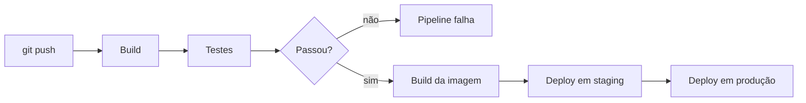

# 04 · CI/CD

**Tempo que gastei aqui:** ~22h · **Pré-requisito:** [03 · Containers](./03-containers.md) · **Próxima:** [05 · Infraestrutura como código →](./05-infraestrutura-como-codigo.md)

## Por que isso mudou como eu trabalho

Antes de aprender isso, meu "processo de deploy" era: rodar os testes na mão (quando eu lembrava), buildar a imagem na mão, subir na mão, torcer. Uma vez esqueci de rodar os testes antes de subir e um bug bem bobo foi parar em produção — nada catastrófico, mas o suficiente pra eu entender que depender de eu lembrar de fazer as coisas na ordem certa, toda vez, não ia dar certo pra sempre.



## O que CI e CD realmente significam

Integração contínua é isso: toda mudança enviada dispara build e teste automático, na hora, não uma vez por semana. O ponto é pegar problema de integração  código de duas pessoas que não funciona junto  em minutos, não em dias depois que já esqueceram o que mudou. Entrega contínua vai além: garante que, se passou no pipeline, o resultado está pronto pra ir ao ar o "ir ao ar" em si pode ser manual (entrega) ou automático (implantação contínua).

## Pipeline com GitHub Actions

Um workflow mora em `.github/workflows/`, dispara por evento (push, pull request, agenda), roda uma sequência de jobs.

```yaml
name: CI

on:
  push:
    branches: [main]
  pull_request:

jobs:
  test:
    runs-on: ubuntu-latest
    steps:
      - uses: actions/checkout@v4
      - uses: actions/setup-node@v4
        with: { node-version: 20 }
      - run: npm ci
      - run: npm test

  build:
    needs: test
    runs-on: ubuntu-latest
    steps:
      - uses: actions/checkout@v4
      - run: docker build -t minha-api:${{ github.sha }} .
```

O `needs: test` é a linha que eu esqueci de colocar na minha primeira tentativa de pipeline o job de build rodava mesmo com teste falhando, o que na prática significava que eu tinha automatizado a velocidade de colocar bug em produção, não de evitar. Corrigi assim que percebi.

## Pipeline com GitLab CI

Lógica parecida, mas num arquivo único organizado em estágios todo job de um estágio roda em paralelo, o próximo estágio só começa depois que o anterior termina.

```yaml
stages: [test, build, deploy]

test:
  stage: test
  script:
    - npm ci
    - npm test

build:
  stage: build
  script:
    - docker build -t minha-api:$CI_COMMIT_SHORT_SHA .

deploy_producao:
  stage: deploy
  script:
    - ./deploy.sh
  when: manual
  only: [main]
```

`when: manual` no deploy de produção é algo que eu adicionei depois de ficar desconfortável com a ideia de qualquer push ir direto ao ar sem alguém confirmar. Teste e build automáticos, deploy final com um clique humano  um meio termo que funciona bem pra mim.

## Testes automatizados no pipeline

Pipeline sem teste só automatiza a velocidade de colocar bug em produção já vivi isso, é chato. A pirâmide de testes é o modelo que eu uso pra decidir onde investir tempo: muito teste unitário (rápido, isola uma função), menos teste de integração (API + banco juntos), pouco teste end to end (o sistema inteiro, mais lento e mais frágil de manter). Um pipeline bom roda os três, mas testa unitário primeiro  falha rápido, sem esperar o resto.

## Blue-green e canário

Blue-green: dois ambientes idênticos, azul (atual) e verde (novo). Quando o verde está validado, o tráfego troca inteiro, de uma vez. Reverter é instantâneo  só aponta de volta pro azul.

Canário: libera a versão nova pra uma fatia pequena do tráfego real (tipo 5%), observa métrica de erro, só aumenta se estiver saudável. É mais lento que blue-green, mas se algo der errado, só uma fatia pequena de usuário sentiu — não todo mundo de uma vez. Pra mudança que me deixa mais nervoso, prefiro canário justamente por isso.

## Erros que eu cometi

- Pipeline sem `needs` entre jobs build rodando mesmo com teste quebrado, já contei essa acima.
- Teste que dependia da ordem de execução  passava sozinho, falhava quando rodava junto com outro. Levei um tempo pra entender que o problema era esse.
- Deploy em produção sem nenhum tipo de confirmação  corrigido com `when: manual`.
- Segredo direto no YAML do pipeline, achando que "tá num repositório privado, tudo bem". Não tá tudo bem  movi tudo pra secrets da própria ferramenta assim que percebi o risco.

## Exercício prático

1. Pega a aplicação containerizada da [etapa 03](./03-containers.md) e cria um workflow que roda teste a cada push.
2. Adiciona um job de build que só executa se o teste passar, tag da imagem sendo o hash do commit  nunca `latest`.
3. Adiciona deploy automático num ambiente de teste, depois do build.
4. Adiciona deploy em produção com aprovação manual obrigatória.
5. **Confere:** quebra um teste de propósito e vê o pipeline parar no job de teste, sem nem tentar buildar a imagem.

## Perguntas que eu me faço

<details>
<summary>Qual a diferença entre entrega contínua e implantação contínua?</summary>

Em entrega contínua, todo commit que passa no pipeline fica pronto pra ir ao ar, mas alguém aciona o deploy manualmente. Em implantação contínua, esse último passo também é automático  passou no pipeline, foi ao ar, sem intervenção.
</details>

<details>
<summary>Quando faz mais sentido usar canário em vez de blue-green?</summary>

Quando você quer limitar o impacto de um problema que passou despercebido pelos testes a uma fatia pequena de usuário real, observando métrica de produção antes de expor todo mundo. Blue-green reverte mais rápido, mas expõe 100% do tráfego de uma vez.
</details>

## Termos que tive que procurar mais de uma vez

| Termo | O que significa |
|---|---|
| CI | Build e teste automático a cada mudança |
| CD | Entrega ou implantação contínua |
| Pipeline | Sequência automatizada de build, teste, deploy |
| Gate manual | Ponto do pipeline que espera aprovação humana |

## Onde eu fui aprofundar

- [GitHub Actions Docs](https://docs.github.com/en/actions)
- [GitLab CI/CD Docs](https://docs.gitlab.com/ee/ci/)

---
**Próxima etapa:** [05 · Infraestrutura como código →](./05-infraestrutura-como-codigo.md)
