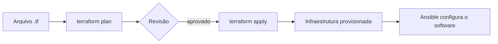

# 05 · Infraestrutura como código

**Tempo que gastei aqui:** ~25h · **Pré-requisito:** [04 · CI/CD](./04-ci-cd.md) · **Próxima:** [06 · Observabilidade →](./06-observabilidade.md)

## Por que eu parei de clicar em console

Eu configurava tudo pelo console do provedor de nuvem, no clique, achando que era mais rápido. Era, na primeira vez. Na segunda vez que precisei recriar o mesmo ambiente (um teste que deu errado e eu tive que refazer do zero), não lembrava exatamente quais opções eu tinha escolhido  e não tinha história nenhuma de mudança pra consultar. Foi aí que entendi o motivo de existir infraestrutura como código: não é sobre ser mais rápido na primeira vez, é sobre ser reproduzível e revisável depois.



## Terraform: providers, state e plano

Terraform é declarativo  você descreve o estado que quer, não o passo a passo pra chegar lá. Provider é o plugin que conversa com uma API específica.

```hcl
provider "aws" {
  region = "us-east-1"
}

resource "aws_instance" "servidor_web" {
  ami           = "ami-0abcd1234"
  instance_type = "t3.micro"

  tags = {
    Nome = "servidor-web"
  }
}
```

O state é onde o Terraform guarda o que ele acha que existe de fato, comparado ao que o código descreve. Eu editei o state manualmente uma vez, tentando "corrigir" algo rápido, e bagunçou a relação entre código e realidade  o próximo `apply` quis destruir coisa que eu não queria destruir. Nunca mais fiz isso. Hoje sei que o state tem que morar num backend remoto, principalmente em time, pra todo mundo trabalhar sobre o mesmo estado.

`terraform plan` mostra o que vai mudar antes de acontecer. Eu tinha o hábito de rodar `apply` direto sem olhar o plano, até um plano que eu não olhei recriar um recurso que eu não queria recriar. Hoje leio o plano inteiro, sempre, principalmente em produção.

```bash
terraform init
terraform plan
terraform apply
```

## Módulos reutilizáveis

Eu copiava e colava o mesmo bloco de VPC em cada projeto novo, até perceber que era o mesmo tipo de problema de copiar e colar código numa aplicação. Um módulo empacota isso uma vez só.

```hcl
module "rede" {
  source = "./modules/vpc"

  cidr_block         = "10.0.0.0/16"
  sub_redes_publicas = ["10.0.1.0/24", "10.0.2.0/24"]
}
```

Se acho um erro na lógica da VPC, corrijo o módulo uma vez, e todo lugar que usa ele já fica corrigido bem diferente de ter que lembrar de corrigir em cinco lugares copiados.

## Ansible: playbooks e roles

Terraform provisiona a máquina, Ansible configura o que roda dentro dela. Não precisa de agente instalado  conecta via SSH e roda as tarefas do playbook.

```yaml
- hosts: servidores_web
  become: true
  tasks:
    - name: Instalar nginx
      apt:
        name: nginx
        state: present

    - name: Garantir que o nginx está rodando
      service:
        name: nginx
        state: started
        enabled: true
```

A palavra que eu não entendia direito no começo era idempotência: rodar o mesmo playbook duas vezes deveria dar o mesmo resultado, sem efeito colateral extra na segunda vez. A task de `apt` acima não reinstala nginx se ele já está lá só garante o estado final. Eu escrevi um playbook usando `shell: echo linha >> arquivo` uma vez, sem perceber que isso duplicava a linha a cada execução  não era idempotente, e o arquivo de configuração ficou uma bagunça depois de rodar o playbook algumas vezes.

## Versionamento no Git

Todo `.tf` e todo playbook vai pro Git, mesmo fluxo de PR que código de aplicação. O motivo prático: quando algo quebra em produção, o primeiro lugar que eu olho hoje é o histórico de mudanças recentes na infraestrutura  várias vezes o problema estava ali, numa mudança de duas semanas atrás que ninguém mais lembrava.

## Erros que eu cometi

- State versionado no Git direto, sem backend remoto  contei acima o problema que isso causou.
- `apply` sem olhar o `plan` primeiro, e um recurso indesejado sendo recriado.
- Playbook não idempotente com `shell: echo ... >>`, arquivo duplicando conteúdo a cada execução.
- Mudei algo manualmente no console "só dessa vez", e o Terraform detectou a divergência e tentou desfazer minha mudança manual no próximo `apply`.

## Exercício prático

1. Escreve um módulo Terraform que provisiona a VPC da [etapa 02](./02-cloud-computing.md), reutilizável.
2. Usa o módulo pra subir uma VM na sub-rede pública.
3. Escreve um playbook Ansible que instala Docker nessa VM e garante o serviço ativo.
4. Roda o mesmo playbook duas vezes seguidas  a segunda execução não deveria reportar nenhuma mudança.
5. **Confere:** roda `terraform plan` sem ter mudado nada no código. Deveria dizer "nenhuma alteração" — isso confirma que o state reflete a realidade.

## Perguntas que eu me faço

<details>
<summary>Por que nunca editar o state manualmente ou versionar ele junto com o código?</summary>

O state conecta o código à infraestrutura real  editar na mão pode dessincronizar isso e causar destruição ou recriação acidental de recurso, como aconteceu comigo. Também pode ter dado sensível, e em time precisa estar num backend remoto compartilhado, senão cada pessoa trabalha sobre uma versão diferente do estado.
</details>

<details>
<summary>O que quer dizer um playbook ser idempotente, na prática?</summary>

Rodar várias vezes dá o mesmo resultado final, sem duplicar efeito. Importa porque playbook costuma ser reexecutado  sem idempotência, cada execução extra pode causar bagunça, como o arquivo de configuração duplicado que me aconteceu.
</details>

## Termos que tive que procurar mais de uma vez

| Termo | O que significa |
|---|---|
| Provider | Plugin do Terraform que integra com uma API específica |
| State | Mapeamento entre código declarado e infraestrutura real |
| Drift | Divergência entre o que o código diz e o que existe de fato |
| Idempotência | Repetir a operação dá o mesmo resultado |
| Playbook | Arquivo YAML com tarefas de configuração no Ansible |

## Onde eu fui aprofundar

- [Terraform Documentation](https://developer.hashicorp.com/terraform/docs)
- [Ansible Documentation](https://docs.ansible.com/)

---
**Próxima etapa:** [06 · Observabilidade →](./06-observabilidade.md)
