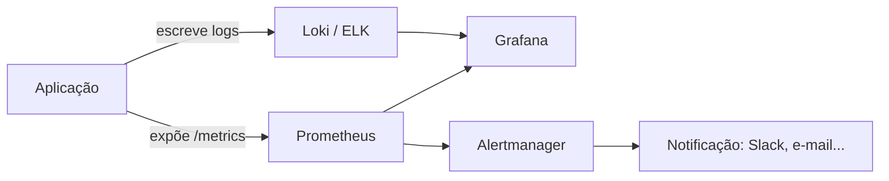

  # 06 · Observabilidade

**Tempo que gastei aqui:** ~20h · **Pré-requisito:** [05 · Infraestrutura como código]( ./05-infraestrutura-como-codigo.md) · **Próxima:** [07 · Segurança →](./07-seguranca.md)

## O que me fez levar isso a sério

Eu tinha automação de deploy funcionando havia um tempo, mas nenhum jeito real de saber se a aplicação estava saudável depois de ir ao ar  só descobria quando alguém reclamava, e nesse ponto já tinha passado tempo suficiente pra afetar gente de verdade. Depois de um incidente que eu só percebi porque um colega falou "acho que a API tá lenta", decidi que não ia mais operar sem conseguir ver o que estava acontecendo por dentro.



## Métricas com Prometheus

O Prometheus funciona por coleta ativa  ele que vai buscar o dado num endpoint (`/metrics`), a aplicação não precisa saber pra onde os dados vão. Isso simplificou bastante quando fui implementar: só precisei expor um endpoint HTTP, sem me preocupar com configurar envio de dados pra lugar nenhum.

```
# HELP http_requests_total Total de requisições HTTP
# TYPE http_requests_total counter
http_requests_total{method="GET",status="200"} 1523
http_requests_total{method="GET",status="500"} 4
```

Existem quatro tipos de métrica  counter (só cresce), gauge (sobe e desce), histogram e summary (pra distribuição, tipo latência). No começo eu misturava counter com gauge sem perceber a diferença, e meus gráficos de "total de requisição" ficavam com quedas estranhas que não faziam sentido porque eu tinha modelado como gauge algo que só deveria crescer.

## Dashboards com Grafana

Grafana lê fontes de dado (Prometheus, Loki) e transforma em painel visual. O erro que eu cometi de cara foi colocar todo indicador que existia no mesmo dashboard  ficou impossível de ler. Hoje uso os quatro sinais de ouro como norte: latência, tráfego, erro, saturação. Se um painel não ajuda a responder uma dessas quatro perguntas, ele provavelmente não devia estar ali.

```promql
sum(rate(http_requests_total{status=~"5.."}[5m]))
/
sum(rate(http_requests_total[5m]))
```

## Logs centralizados (ELK ou Loki)

Com a aplicação rodando em várias réplicas, `ssh` e `tail -f` simplesmente parou de funcionar pra mim — eu não sabia mais em qual réplica olhar. Loki resolveu isso indexando só metadado (labels), mantendo o conteúdo comprimido — mais barato que o ELK Stack, que indexa tudo.

A mudança que fez mais diferença na prática foi trocar log de texto livre por log estruturado:

```json
{"timestamp": "2026-08-30T14:22:01Z", "level": "error", "service": "api", "request_id": "a1b2c3", "message": "Falha ao conectar ao banco"}
```

Antes, eu tentava caçar erro com `grep` em texto solto e quase sempre errava o padrão. Com log estruturado, filtro por `level=error` e `service=api` direto, sem depender de adivinhar o formato exato da frase.

## Alertas com Alertmanager

Dashboard só ajuda se alguém tá olhando na hora certa  e ninguém fica olhando 24 horas. Alertmanager transforma regra de alerta em notificação de verdade (Slack, no meu caso).

```yaml
groups:
  - name: api
    rules:
      - alert: TaxaDeErroAlta
        expr: sum(rate(http_requests_total{status=~"5.."}[5m])) / sum(rate(http_requests_total[5m])) > 0.05
        for: 5m
        labels: { severity: critical }
        annotations:
          summary: "Taxa de erro acima de 5% nos últimos 5 minutos"
```

Minha primeira versão desse alerta não tinha o `for: 5m`  disparava a cada pico de meio segundo, o que em uma noite me acordou três vezes por picos que se resolviam sozinhos antes de eu nem abrir o notebook. Adicionei a janela de 5 minutos e o alerta virou útil de novo, em vez de irritante.

## Erros que eu cometi

- Monitorei só CPU e memória no começo, ignorando taxa de erro percebida de fato pelo usuário  que é o que realmente importa.
- Alerta sem `for`, disparando por pico momentâneo  já contei, foi uma noite ruim.
- Log em texto livre por muito tempo, dificultando qualquer busca séria.
- Dashboard com painel demais, onde nada se destacava de verdade.

## Exercício prático

1. Instrumenta a aplicação da [etapa 03](./03-containers.md) pra expor `/metrics` no formato Prometheus, contando requisição por status.
2. Configura o Prometheus pra coletar isso periodicamente.
3. Monta um dashboard no Grafana com pelo menos três painéis: taxa de requisição, taxa de erro, latência.
4. Configura um alerta pra taxa de erro acima de 5% sustentada por 5 minutos.
5. **Confere:** força um erro de propósito (retorna `500` manualmente) e vê o alerta disparar mas só depois dos 5 minutos, não na hora.

## Perguntas que eu me faço

<details>
<summary>Por que Prometheus usa pull em vez de push?</summary>

Simplifica a arquitetura  a aplicação só expõe um endpoint, sem saber nada sobre pra onde o dado vai. E se o Prometheus não consegue coletar de um serviço, isso já é, por si só, um sinal de que algo está errado.
</details>

<details>
<summary>O que é fadiga de alerta e como evitar?</summary>

É quando alerta demais (ou por coisa boba) faz as pessoas pararem de reagir, tratando tudo como ruído  foi o que quase aconteceu comigo na noite dos três alertas falsos. Evita calibrando limite realista e usando janela de tempo sustentado, não pico instantâneo.
</details>

## Termos que tive que procurar mais de uma vez

| Termo | O que significa |
|---|---|
| Counter | Métrica que só cresce |
| Gauge | Métrica que sobe e desce |
| Log estruturado | Log em formato de dado (JSON), não texto solto |
| Fadiga de alerta | Alerta demais fazendo as pessoas ignorarem tudo |

## Onde eu fui aprofundar

- [Prometheus Docs](https://prometheus.io/docs/)
- [Grafana Docs](https://grafana.com/docs/)
- [Grafana Loki Docs](https://grafana.com/docs/loki/latest/)

---
**Próxima etapa:** [07 · Segurança →](./07-seguranca.md)
