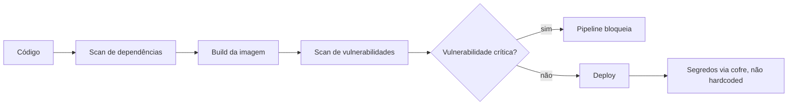

# 07 · Segurança

**Tempo que gastei aqui:** ~18h · **Pré-requisito:** [06 · Observabilidade](./06-observabilidade.md) · **Última etapa da trilha**

## Por que deixei isso pro final (e por que quase me arrependi disso)

Segurança foi a etapa que eu mais adiei  parecia burocracia, uma revisão chata no final de tudo. Mudei de ideia depois de rodar um scanner de vulnerabilidade numa imagem que eu já usava havia meses em teste e encontrar uma dependência com uma falha crítica catalogada, parada ali o tempo todo sem eu saber. Nada foi explorado, que eu saiba — mas foi o suficiente pra entender que segurança não pode ser a última coisa que você olha, tem que estar dentro do processo desde o início.



## Gerenciamento de segredos

Eu tinha senha de banco direto numa variável de ambiente no YAML do pipeline — funcionava, então não vi motivo pra mudar, até entender que aquilo ficava versionado no Git pra sempre, mesmo se eu deletasse o commit depois. Quem já tinha clonado o repositório continuava com acesso.

```bash
vault kv put secret/api/db senha="valor-secreto"
vault kv get secret/api/db
```

O que mudou de verdade pra mim foi entender rotação: segredo que nunca muda é um risco que só cresce com o tempo  se vazar uma vez, mesmo sem eu saber, continua valendo pra sempre. Um cofre com segredo de curta duração resolve isso.

## Varredura de vulnerabilidades

Foi aqui que encontrei o problema que citei no início. Uso o Trivy hoje, integrado no pipeline  não como checagem manual esporádica, mas automática, a cada build.

```bash
trivy image minha-api:1.4.0
```

Se aparece vulnerabilidade crítica, o pipeline falha, do mesmo jeito que falharia com teste quebrado. Antes eu rodava isso "de vez em quando, quando lembrava"  e foi exatamente por isso que uma vulnerabilidade ficou parada meses sem eu perceber.

## IAM com privilégio mínimo

Voltando ao que já vi na [etapa 02](./02-cloud-computing.md): cada identidade só com a permissão que precisa, nada além.

```json
{
  "Effect": "Allow",
  "Action": ["s3:GetObject", "s3:PutObject"],
  "Resource": "arn:aws:s3:::backups-app/*"
}
```

O erro que eu ainda pego às vezes: dar permissão ampla "só por agora, pra resolver isso rápido" e esquecer de revogar depois. Hoje tento revisar isso periodicamente, mas admito que não faço isso com a frequência que deveria.

## Hardening de containers

Reduzir o que não é estritamente necessário: rodar como não-root (retomando a [etapa 03](./03-containers.md)), sistema de arquivo somente leitura quando dá, nada de ferramenta de debug na imagem final de produção.

```yaml
securityContext:
  runAsNonRoot: true
  readOnlyRootFilesystem: true
  allowPrivilegeEscalation: false
```

Configurei isso depois do susto do scanner  três linhas que fecham bastante porta ao mesmo tempo: não roda como root, não escreve fora de volume explícito, não escala privilégio nem que algum processo interno tente.

## Erros que eu cometi

- Senha em variável de ambiente fixa no YAML  já contei, foi o gatilho pra levar essa etapa a sério.
- Rodar scan de vulnerabilidade "de vez em quando" em vez de automático  foi assim que uma falha crítica ficou parada meses.
- Dar permissão ampla temporária e esquecer de revogar. Ainda pego a mim mesmo fazendo isso.
- Confiar só na segurança de perímetro (firewall, VPC) sem reforçar dentro de cada camada  se o perímetro falhar, não sobra segunda linha de defesa.

## Exercício prático

1. Move qualquer segredo dos exercícios anteriores pra um cofre, tirando de variável de ambiente fixa.
2. Adiciona ao pipeline da [etapa 04](./04-ci-cd.md) um scan de vulnerabilidade que falha o pipeline em caso de achado crítico.
3. Revisa as políticas de IAM da [etapa 02](./02-cloud-computing.md) e remove qualquer permissão que não seja estritamente necessária.
4. Configura `securityContext` nos deployments da [etapa 03](./03-containers.md)  não-root, sistema de arquivo somente leitura.
5. **Confere:** roda o scan manualmente e olha o resultado com calma — mesmo que só ache coisa de baixa severidade, você deveria conseguir explicar cada item, não só ignorar a lista.

## Perguntas que eu me faço

<details>
<summary>Por que segredo fixo em variável de ambiente é problema, mesmo em repositório privado?</summary>

Fica versionado no histórico do Git pra sempre  deletar o commit depois não tira o acesso de quem já clonou antes. E segredo fixo nunca expira: se vazar por qualquer canal (log, print, repositório que ficou público por engano), continua válido até alguém trocar na mão.
</details>

<details>
<summary>O que muda, na prática, quando segurança vira parte do pipeline em vez de revisão manual isolada?</summary>

Checagem roda automática a cada mudança, com critério claro de bloqueio igual teste automatizado. Detecta problema em minutos, no momento em que o código é escrito, não semanas depois numa auditoria separada. Foi exatamente a falta disso que deixou uma vulnerabilidade crítica parada meses no meu caso.
</details>

## Termos que tive que procurar mais de uma vez

| Termo | O que significa |
|---|---|
| CVE | Identificador público de uma vulnerabilidade conhecida |
| Rotação de segredo | Trocar credencial periodicamente pra limitar o estrago de um vazamento |
| Hardening | Reduzir a superfície de ataque de um sistema |
| Privilégio mínimo | Dar só a permissão estritamente necessária |

## Onde eu fui aprofundar

- [HashiCorp Vault Docs](https://developer.hashicorp.com/vault/docs)
- [Trivy — scanner de vulnerabilidades](https://trivy.dev/)

## Como me sinto tendo terminado a trilha

Se você fez os exercícios de cada etapa, passou pelo ciclo inteiro: do terminal a um pipeline com deploy automatizado, infraestrutura versionada, observabilidade e segurança de verdade integradas não só teoria separada. Pra mim, o que fez tudo se encaixar não foi nenhuma etapa isolada, foi aplicar junto num projeto pessoal depois. Recomendo fazer o mesmo antes de considerar que "terminou"  é usando que os conceitos separados viram um sistema só na cabeça.
